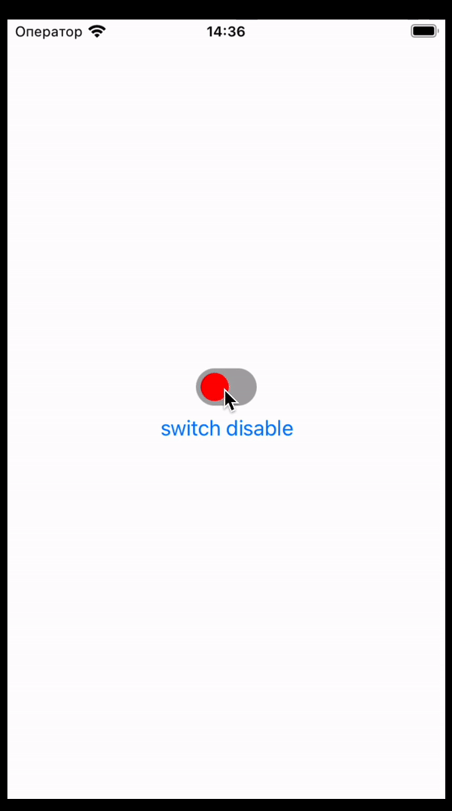

# react-native-switch [](https://www.npmjs.com/package/@splicer97/react-native-switch) [](http://www.npmtrends.com/@splicer97/react-native-switch)

Custom Switch component for React Native that use Reanimated and Gesture Handler

.

## Installation

First, you need to install and configure the [Reanimated](https://docs.swmansion.com/react-native-reanimated/) and [Gesture Handler](https://docs.swmansion.com/react-native-gesture-handler/) libraries

Then install library

```sh
npm install @splicer97/react-native-switch
```

or

```sh
yarn add @splicer97/react-native-switch
```

## Usage

```js
import Switch from '@splicer97/react-native-switch';

// ...
const [state, setState] = useState(false);

return (
  <GestureHandlerRootView style={{ flex: 1 }}>
    <View style={styles.container}>
      <Switch value={state} onValueChange={setState} />
    </View>
  </GestureHandlerRootView>
);
```

## Props

| Props                     | Type                       | Required | Description                                                                                                                         |
| ------------------------- | -------------------------- | -------- | ----------------------------------------------------------------------------------------------------------------------------------- |
| `value`                   | `boolean`                  | `true`   | Current state of the component                                                                                                      |
| `onValueChange`           | `(value: boolean) => void` | `true`   | Change of component state                                                                                                           |
| `disabled`                | `boolean`                  | `false`  | Inactive state of the component                                                                                                     |
| `activeColor`             | `string`                   | `false`  | Container color when component is active                                                                                            |
| `inactiveColor`           | `string`                   | `false`  | Container color when component is inactive                                                                                          |
| `disabledActiveColor`     | `string`                   | `false`  | Container color when component is active and disabled                                                                               |
| `disabledInactiveColor`   | `string`                   | `false`  | Container color when component is inactive and disabled                                                                             |
| `shouldCancelWhenOutside` | `boolean`                  | `false`  | Should a swipe handler be end if your finger is outside the component. Default false                                                |
| `containerStyle`          | `StyleProp<ViewStyle>`     | `false`  | Switch container style                                                                                                              |
| `circleStyle`             | `StyleProp<ViewStyle>`     | `false`  | Switch circle style                                                                                                                 |
| `trackWidth`              | `number`                   | `false`  | The width that the circle will be able to move. Default formula is 'containerWidth - circleWidth - containerPaddingHorizontal \* 2' |

## Contributing

See the [contributing guide](CONTRIBUTING.md) to learn how to contribute to the repository and the development workflow.

## License

MIT

---

Made with [create-react-native-library](https://github.com/callstack/react-native-builder-bob)
